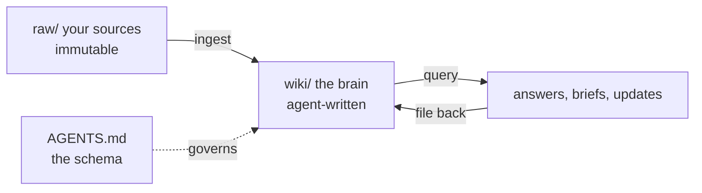

# Workshop quickstart: build your own brain tonight

You just watched a brain that has been compounding for two months. You are going to build yours
in the next hour, on your real accounts, and demo it at 7:30.

---

## Before you arrive (or first 5 minutes)

| Need | Detail |
|---|---|
| An agent tool, logged in | Claude Desktop (easiest), Claude Code, or Codex / Copilot CLI |
| This repo on your laptop | [Direct ZIP download](https://github.com/jvanthienen/second-brain/archive/refs/heads/master.zip) (no GitHub account needed) or `git clone` if you use git |
| 1 to 3 real meeting transcripts or notes | Your fuel. Export from your notetaker, or paste from memory into a text file |
| Optional: a CRM export (CSV) | Only if you pick the Pipeline Review use case |
| Optional: [Obsidian](https://obsidian.md) | Free. Open the repo folder as a vault and turn on graph view |

**You need zero connectors to build the baseline brain.** No IT approvals, no OAuth. The core
loop is just files plus the agent. Connectors add reach later, per use case.

---

## Step 1 (10 min): install it, make it yours

1. **Install the brain into your agent.** Full click-by-click in
   [`demo/connect-guide.md`](demo/connect-guide.md), Recipe 0. Short version:
   - **Claude Desktop**: new chat > type "open the folder second-brain in my Documents and
     read AGENTS.md" > click **Add folder** when it asks.
   - **Claude Code**: rename `AGENTS.md` to `CLAUDE.md`, run `claude` inside the folder.
   - **Codex / Copilot CLI / Gemini CLI**: run inside the folder; `AGENTS.md` works as-is.
   - Sanity check for everyone: ask **"list the wiki pages."** If it lists accounts and
     people, your brain is installed.
2. **Make it yours.** Say: "Read AGENTS.md and BRAIN.md. Then interview me and rewrite
   BRAIN.md so it is about me, not the sample persona." Two minutes of questions and the
   brain knows who it works for.
3. **Keep the sample data tonight.** The pre-loaded universe is fictional (invented accounts
   and people) and it is your safety net: a full, connected wiki to explore, and something
   beautiful to demo if your own transcripts turn out thin. Your ingests in Step 2 add YOUR
   accounts alongside it. Say "clear the sample wiki" when you get home, or keep it to
   practice on.

## Step 2 (15 min): first ingest

1. Drop one real transcript into `raw/_inbox/`.
2. Say: **"Ingest the source in raw/_inbox."**
3. Watch. It reads the source, discusses takeaways, writes pages into `wiki/`, updates the
   index and the log. If you have Obsidian open, watch the graph grow.

That moment is your brain's first memory. Everything after this compounds.

## Step 3 (rest of the hour): pick a use case and BUILD the skill

Pick ONE card from [`demo/use-cases/`](demo/use-cases/). Each card has your agent interview
you, help you connect what you have (or fall back to files), and then write YOUR OWN version
of the skill before you run it. The pro versions already ship in
[`automations/`](automations/): don't peek until yours runs, then open the shipped one and
steal what yours is missing. Everything you don't build tonight goes home with you in the
same folder.

| Card | How it connects | Fallback if no connection |
|---|---|---|
| [Account Researcher](demo/use-cases/account-researcher.md) | WEB + API: web search, add a scraper API (Firecrawl) for depth | Works out of the box |
| [Stakeholder Map](demo/use-cases/stakeholder-map.md) | API: Happenstance for your network + warm paths | Your LinkedIn connections export (CSV), or paste manually |
| [News Watch](demo/use-cases/news-watch.md) | WEB: built-in search, nothing extra | Scheduling is a take-home |
| [Pre-Meeting Prep](demo/use-cases/pre-meeting-prep.md) | MCP / API: your notetaker (Granola, Fireflies) + calendar | Paste the invite, drop the transcript file |
| [Pipeline Review](demo/use-cases/pipeline-review.md) | MCP: your CRM (HubSpot, Attio have official MCPs) | Bring a CSV export instead |
| [Exec & Team Update](demo/use-cases/exec-team-update.md) | CONNECTOR: Slack or Teams, one click | Draft on screen is the demo |

Tier 0 (everyone): tool + repo + built-in web search. Tier 1 (per card): the middle column,
each with a no-OAuth fallback. Do not spend your build hour fighting a login screen.

**Best take-home:** [`automations/daily-capture.md`](automations/daily-capture.md). One
sentence to schedule, and from tomorrow every meeting you have files itself into your brain's
inbox at 6 PM. It is the difference between a wiki you maintain and a brain that compounds.

---

## Your 3-minute demo at 7:30

Show three things, in this order:

1. **One question answered.** Ask your brain something about your account and read the answer.
2. **One page the agent wrote.** Open it. Point at a claim with a source and date on it.
3. **The log.** `wiki/log.md`, the entry from tonight. That is your brain's first day.

If your use case produced an artifact (a brief, a map, an update), close with it.

---

## Rules that keep it honest

- `raw/` is immutable. The agent reads it, never edits it.
- Unknown numbers are `—`, never `$0`. A zero is a claim, a dash is an admission.
- Contradictions get flagged, never silently overwritten.
- Nothing auto-sends. Draft, review, then it goes.

Full schema: [`AGENTS.md`](AGENTS.md). Setup detail: [`docs/setup.md`](docs/setup.md).
