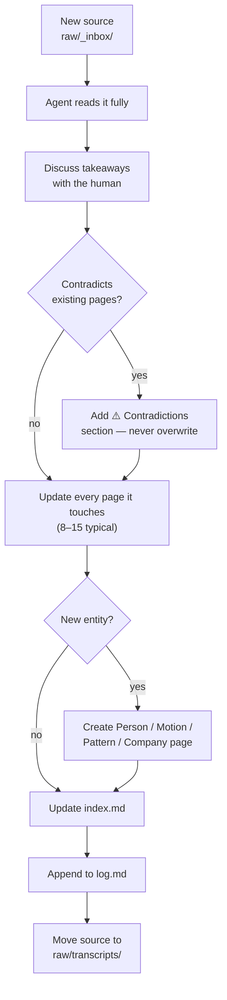

# Architecture

## Three layers

The dividing line is **who writes it**, and it's absolute.

```
┌─ RAW SOURCES ──────────────────────────────────────────┐
│  raw/                                                  │
│  Transcripts · notes · articles · reports              │
│  IMMUTABLE — the agent reads, never writes             │
└────────────────────────┬───────────────────────────────┘
                         │  ingest
┌────────────────────────▼───────────────────────────────┐
│  THE WIKI                                              │
│  wiki/                                                 │
│  Accounts · backgrounders · people · motions           │
│  patterns · blockers · companies · index · log         │
│  THE AGENT OWNS THIS ENTIRELY — you read it            │
└────────────────────────▲───────────────────────────────┘
                         │  governs
┌────────────────────────┴───────────────────────────────┐
│  THE SCHEMA                                            │
│  AGENTS.md                                             │
│  Page types · workflows · conventions · honesty rules  │
│  YOU own this, co-evolved with the agent               │
└────────────────────────────────────────────────────────┘
```

**Why immutable sources matter:** provenance, and re-ingestion. As the wiki gets richer,
re-reading an old source surfaces things you missed — because now there's somewhere to connect
them to. That only works if the source is untouched.

**Why the agent owns the wiki entirely:** the moment humans start hand-editing pages, the agent
can no longer trust what it reads, and you're back to maintaining a wiki manually. Which is the
thing everyone abandons.

---

## Why numbers stay out of the wiki

Two reasons, and the second is the one people miss:

1. **They go stale the moment they're written.** A number in a page has no expiry, and an agent
   will quote it confidently next quarter.
2. **They widen what a single clone exposes.** Structure and reasoning are portable. A financial
   snapshot is not.

The test, from [`AGENTS.md`](../AGENTS.md):

> **Would you ever filter or compare every account by this?**
> Yes → structured data. No → prose in a wiki page.

Wiki pages carry *shape and history* — "consumption up 18% YoY, commitment ends March" — and
point at the data layer for current figures.

---

## The connector boundary

The most important architectural property: **the wiki knows nothing about where data comes
from.**

```
┌─ wiki/ ────────────────────────────────────────┐
│  Never names a vendor, product or API          │
└──────────────────┬─────────────────────────────┘
                   │ reads through
┌──────────────────▼─────────────────────────────┐
│  Connectors: chat · mail · calendar · CRM      │
│  Slack or Teams. Gmail or Outlook. Any CRM.    │
└────────────────────────────────────────────────┘
```

Swap Slack for Teams and nothing in `wiki/` changes. If a connector swap forces an edit inside
`wiki/`, something has leaked across the boundary — fix it.

This is what makes the brain portable between employers, tools and machines.

---

## Ingest data flow



---

## Scaling

| Wiki size | What you need |
|---|---|
| < 50 pages | `index.md` is plenty |
| 50–300 | `index.md` still works. Keep it curated. |
| 300+ | Add a search tool — [`qmd`](https://github.com/tobi/qmd) has a CLI and MCP server |

Below a few hundred pages you genuinely don't need embeddings. The index file plus good page
titles outperforms naive RAG, because the synthesis has already happened.

---

## Security posture

- **No credentials in the repo.** `.env` is gitignored; `.env.example` documents the shape.
- **No personal contact details** in wiki pages — names, titles, reporting lines only.
- **Nothing auto-sends.** Every outbound path stops at draft.
- **Check the remote before pushing.** `git remote -v`. A wiki with real customer detail belongs
  in a private repo on the right account.
